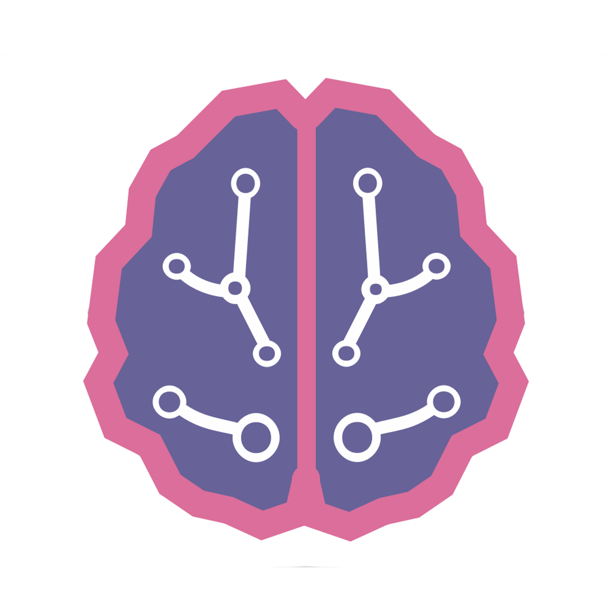
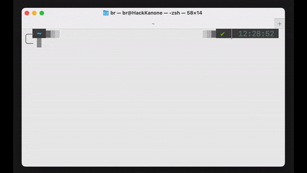

<div align="center">

  
  
  # Daibl


[![python][python-shield]][python-url]
[![pytorch][pytorch-shield]][pytorch-url]
[![HuggingFace][HuggingFace-shield]][HuggingFace-url]
[![pycord][pycord-shield]][pycord-url]
[![whisper][whisper-shield]][whisper-url]
[![coqui][coqui-shield]][coqui-url]

</div>

---

<details>
<summary>Table of Contents</summary>

- [About the project](#about-the-project)
  - [Folder Structure](#folder-structure)
  - [Modules](#modules)
  - [Usage](#usage)
- [Setup Guide](#setup-guide)
- [Additional](#additional)
  - [Docker environment](#docker-environment-beta)
  - [Virtual environment](#virtual-environment-activation)
- [Evaluation](#evaluation)
- [Authors](#authors)
- [License](#license)
- [Remarks](#remarks)

</details>

## <u>About The Project</u>

Daibl is a university project to help students learn more about AI and their Technologies. The acronym Daibl stands for **D**iscord **AI** **B**ot **L**earning. Daibl is a bot inspired by Alexa which can answer general and TH Nuernberg related questions, to help students (especially new ones) navigate their school life easier.

### Folder structure

The folder structure should give a rough overview of the code base and make the project easier to understand.

```sh
📦assets # resources and assets to run the project
 ┣ 📂docs
 ┣ 📂ffmpeg-6.0-full_build
 ┗ ...
📦discord_bot
 ┣ 📂main
 ┃  ┣ 📂Bot     # main Bot application
 ┃  ┣ 📂LLM     # Communicating module with Large-Language-Models
 ┃  ┣ 📂STT     # Module for live transcription (ASR)
 ┃  ┣ 📂TTS_Bot # Module for text-to-speech
 ┃  ┣ 📂scrap   # TODO add description Vincent
 ┃  ┣ 📂util    # Module for utilities
 ┃  ┣ 📜main.py # programm entry point
 ┃  ┗ 📜.env    # token and keys
 ┗ (📂test) # possible test folder
 ```

### Modules

Modules are designed to be interchangeable, for example using different LLMs to generate text

#### Bot

This module contains the code to run the Discord bot. The Discord api pycord is used to create the bot and communicate with the application

#### LLM (Large-Language-Models)

This module focuses on communication with the LLM. Hugging Face serves as the interface for running LLMs. It is a popular platform that provides a comprehensive set of tools and libraries for working with natural language processing (NLP) models and it is particularly well-known for its support of large language models (LLMs).

For our project we built a pipeline with Hugging Face to load the LLM and adjust parameters. The model is loaded into the GPU to accelerate processing. For the LLM different versions of Llama 2 and Vicuna were used. Onced loaded we can prompt question/text to the model to let it generate an answer which will be further processed by the bot.

#### STT (Speech to text)

TODO (ASR) Hotword

This module uses whisper to transcripe audio data from discord. The data is saved as a wav file and given to whisper to process. The transcriped text is then given to the TTS module.

#### TTS_Bot (Text to speech)

TTS_Bot handles the training/finetuning of voice models as well as generating the voice to speak with the user. The text is processed by the voice model and saved to a wav file which is being played over the voice channel to the user.

To run the voice model Coqui.ai TTS is being used. Coqui.ai TTS is a library for advanced Text-to-Speech generation. The platform offers pretrained models for over 1100 languages, along with tools for training new models and fine-tuning existing ones in any language. Additionally, it provides utilities for dataset analysis and curation.

#### Scrap

TODO Explain scrap, what technology is used, how data is processed ...

### Usage

TODO Gif on how to use the bot

## <u> Setup Guide </u>

<div align="center">
  
</div>

Clone the repository:

```sh
mkdir daibl
cd daibl
git clone https://git.informatik.fh-nuernberg.de/devpsoft_studios/daibl.git
```

or

```sh
cd existing_repo
git remote add origin https://git.informatik.fh-nuernberg.de/devpsoft_studios/daibl.git
git branch -M main
```

Create a $`\textcolor{red}{\text{.env file}}`$ in the **daibl/discord_bot/main** directory and set the environment variables: (read the [remarks](#remarks) after creating the file)

```sh
# .env example
DISCORD_TOKEN=<your_token>
DISCORD_GUILD=<guild_or_server_name>
HUGGINGFACEHUB_API_TOKEN=<your_api_token>
PROJECT_PATH=<path/to/project> # Full path to project to simplify imports (if you want to read further into this google Python Path)
DATABASE_PATH=<path/to/database/of/context_documents>
```

Create a [virtual environment](#virtual-environment-activation) and install the requirements

Download voice models or use existing ones.

## <u> Additional </u>

### Docker environment (beta)

The discord bot should be runable in any environment. For this purpose we use Docker. So file paths may be different when running on Windows. Devs should read through our [Docker documentation](assets/docs/Docker.md) to work on the project.

### **Virtual environment activation**

The virtual environment is used to make packaging easier and to only install the needed dependencies. To setup the virtual environment look into the corresponding [virtual environment documentation](assets/docs/Venv.md)

## <u> Evaluation </u>

TODO eval of LLMs and context

## <u> Authors </u>

[@David](https://github.com/davidg-h)
[@Vincent](https://github.com/firevince)
[@Patrick](https://github.com/DieserPat)
[@Elisabeth](https://github.com/elisabethvolkinshtein)

## <u> License </u>

Click [this](/LICENSE) to read the license.

---

---

---

## Remarks

You must adjust paths in some files / python scripts. For example the [tts-training-file line 35](discord_bot/main/TTS_Bot/Train_Voice/Training_Scripts/train_vits_win.py).

**In general:**
Every time the user/developer has to make a change for path reasons it will be marked as

```sh
# !!Change!! ...
```

<!-- MARKDOWN LINKS & IMAGES -->
<!-- https://www.markdownguide.org/basic-syntax/#reference-style-links -->
<!-- https://shields.io/badges (Bagde generator) -->
<!-- https://github.com/Ileriayo/markdown-badges -->
[python-shield]: https://img.shields.io/badge/Python-3.9-3776AB.svg?style=flat&logo=python&logoColor=white
[python-url]: https://www.python.org

[pytorch-shield]: https://img.shields.io/badge/PyTorch-latest-EE4C2C.svg?style=flat&logo=pytorch
[pytorch-url]:https://pytorch.org

[HuggingFace-shield]: https://img.shields.io/badge/%F0%9F%A4%97%20Hugging%20Face-latest-orange
[HuggingFace-url]: https://huggingface.co/

[pycord-shield]: https://img.shields.io/badge/Pycord-voice-neongreen?logo=discord&logoColor=white
[pycord-url]: https://docs.pycord.dev/en/stable/

[whisper-shield]: https://img.shields.io/badge/Whisper-74aa9c?logo=openai&logoColor=white
[whisper-url]: https://github.com/openai/whisper

[coqui-shield]: https://img.shields.io/badge/%F0%9F%90%B8Coqui.ai_TTS-green
[coqui-url]: https://github.com/coqui-ai/TTS