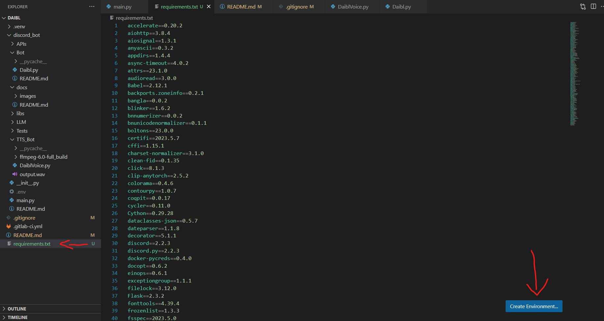
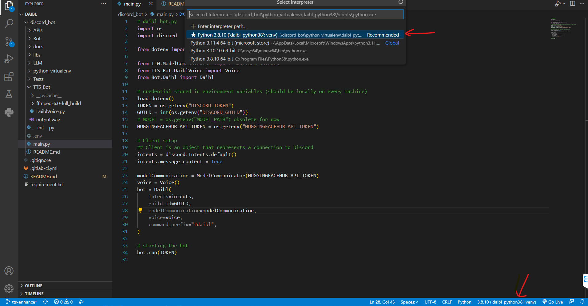

# Steps to get a virtual environment running in VS Code with python

---
-> | [Back](/README.md)
-|-

1. Step: [Install Python 3.8.10](https://www.python.org/downloads/release/python-3810/)

2. Step: Create virtual environment from requirements.txt (vscode)

    

3. Step: [Select the virtual environment python.exe as the **python interpreter**](https://code.visualstudio.com/docs/python/environments) (vscode)

    

4. Step **Important**: [Before pushing to repository, update the requirements.txt (only if new packages are used in the project)](https://pip.pypa.io/en/stable/cli/pip_freeze/)

    In the terminal:

    ```sh
    pip list # lists all packages
    pip freeze > requirements.txt 
    # alternative: python -m pip freeze > requirements.txt
    ```

<br/>

**If you get an error try this first**: (Error is related to the [ExecutionPolicy](https://stackoverflow.com/questions/18713086/virtualenv-wont-activate-on-windows))

Open Powershell.exe as Admin and enter:

```sh
Set-ExecutionPolicy Unrestricted -Force
```

This overwrites the type of execution of scripts

### Deactivation and revert changes

```sh
# Before Reverting the ExecutionPolicy deactivate the virtual environment in the terminal
deactivate # deactivates virtual environment

Set-ExecutionPolicy Restricted -Force

Get-ExecutionPolicy # Check if Restricted is set back as default
```

To check if the virtual environment is active:

```sh
python --version
# out: Python 3.8.10
```

### To run the project without the virtual environment get these package/dependencies

```sh
pip install -r requirements.txt
```

https://janakiev.com/blog/jupyter-virtual-envs/